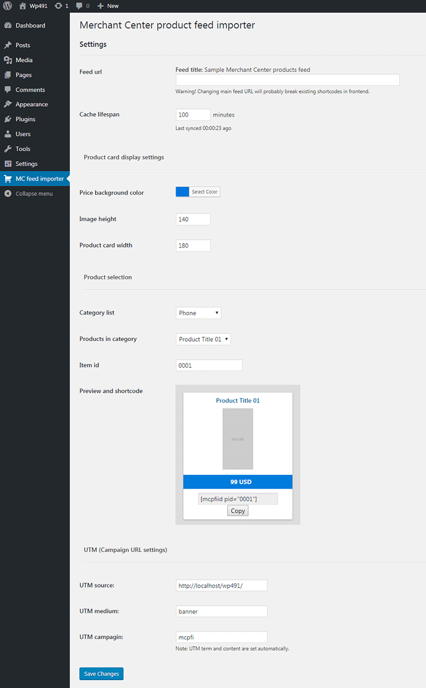

# Merchant Center product feed importer

**Wordpress plugin to fetch and display products from your e-commerce Google Merchant Center XML feed on any wordpress site.**

## Description
Fetch and display information about products from Google Merchant Center product XML (Google Shopping) feed on your wordpress site. All you need is valid feed URL and plugin will generate shortcodes to display product cards on your site.

Feed structure and specification are explained in [Google Merchant Center Help](https://support.google.com/merchants/answer/7052112?visit_id=1-636317402488791740-723275688&hl=en&rd=1).

## Frequently Asked Questions

##### Does it supports other product feed types?

No. This plugin is only Google Shopping feed specific.

##### How can I change look od product cards?

Currently you can change price background color of all cards, by using color picker in "Box Color" option on settings page.

##### Is there any way to add UTM parameters to product url?

Yes. On settings page you can provide UTM source, medium and campagin parameters. Term and content parameters are set automatically and are based on product variables.

##### What is cache livespan option?

Your feed is copied locally to your plugin directory. With "cache lifespan" you can set interval for refreshing local file. Time is in minutes. Usually few hours should be okay.

##### Why changing feed url will break shortcodes?

Plugin uses `<g:id>` parameter from feed to generate product specific shortcode. Changing feed url will also change database for products IDs therefore break shortcodes.

##### What kind of product feed this plugin is compatible?
Feed must be RSS 2.0 and meet requirements described [here](https://support.google.com/merchants/answer/160589?hl=en). The easiest way to check if your feed is compatible with this plugin is to look for this line in your xml: `<rss xmlns:g="http://base.google.com/ns/1.0" version="2.0">` If exist, feed should be compatible.

## Screenshots
> 

## Changelog

* 1.0
Initial release

* 1.1
Added: option for changing image height
Added: better product id handling
Fixed: removed global styles in favor to inline
Fixed: some CSS rendering issues
Fixed: better html markup for product boxes

* 1.15
Added: setting for card width
Added: additional field validation
Added: additional WP related, security check
Fixed: input validation sanitization for backend settings
Fixed: escaping data from xml
Fixed: minor layout fixes for settings page
